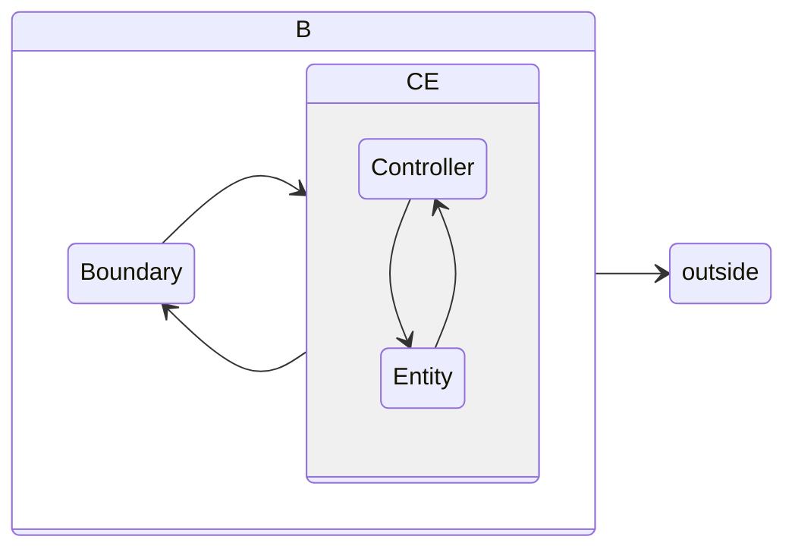

# DDD
领域设计

> From WIKI:
> Domain-driven design (DDD) is an approach to developing software for complex needs by deeply connecting the implementation to an evolving model of the core business concepts.
> * 把项目的主要重点放在核心领域（core domain）和域逻辑
> * 把复杂的设计放在有界域（bounded context）的模型上
> * 发起一个创造性的合作之间的技术和域界专家以迭代地完善的概念模式，解决特定领域的问题

在聊到DDD的时候，我经常会做一个假设：假设你的机器内存无限大，永远不宕机，在这个前提假设下，我们是不需要持久化数据的，也就是我们可以不需要数据库，那么你将会怎么设计你的软件？这就是我们说的Persistence Ignorance：持久化无关设计。

可以认为持久化是 DDD 的一个外部依赖

## 一些学习资料
1. [DDD 简书](https://www.jianshu.com/nb/25336605)
2. [DDD blog](http://zhangyi.xyz/categories/DDD/)
3. [DDD 文章](https://www.cnblogs.com/Zachary-Fan/p/5991674.html)

## DDD 中的 DB
* 领域模型是用于领域操作的，当然也可以用于查询（read），不过这个查询是代价的。在这个前提下，一个aggregate可能内含了若干数据，这些数据除了类似于getById这种方式，不适用多样化查询（query），领域驱动设计也不是为多样化查询设计的。
* 查询是基于数据库的，所有的复杂变态查询其实都应该绕过Domain层，直接与数据库打交道。
* 再精简一下：领域操作->objects, 数据查询->table rows。

## DDD 中的 DI
可以通过一个 Bean 的 Factory 来生成对象，从而注入

## 各种 DDD 中的模式
### Event Souring
### CQRS
Command and Query Responsibility Segregation，直译为命令和查询职责分离设计。简单来说，就是修改类操作和查询查操作，由两个不同的*服务*实现，中间通过消息服务来同步，保证最终一致性。

对于数据实时性要求高的场景不合适，一图胜万言：

### ECB
`outside <-- {Boundary <--> [Controller <--> Entity]}`

1. 实体：领域模型对象，主要包含领域所需的数据（属性），及对象上可进行的行为操作
2. 控制：作为边界和实体协调都的对象，控制每种场景下端到端的行为
3. 边界：在系统边界上的对象，一些对象可以是系统的前端，如一个 Rest 接入点；其它边界对象负责系统的后端，如管理和数据库或其他外部通信

